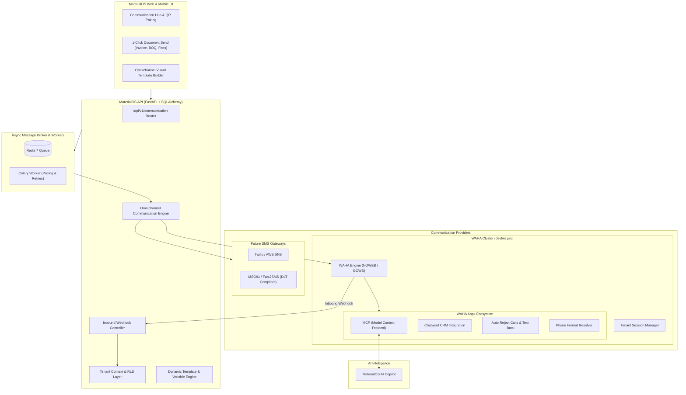
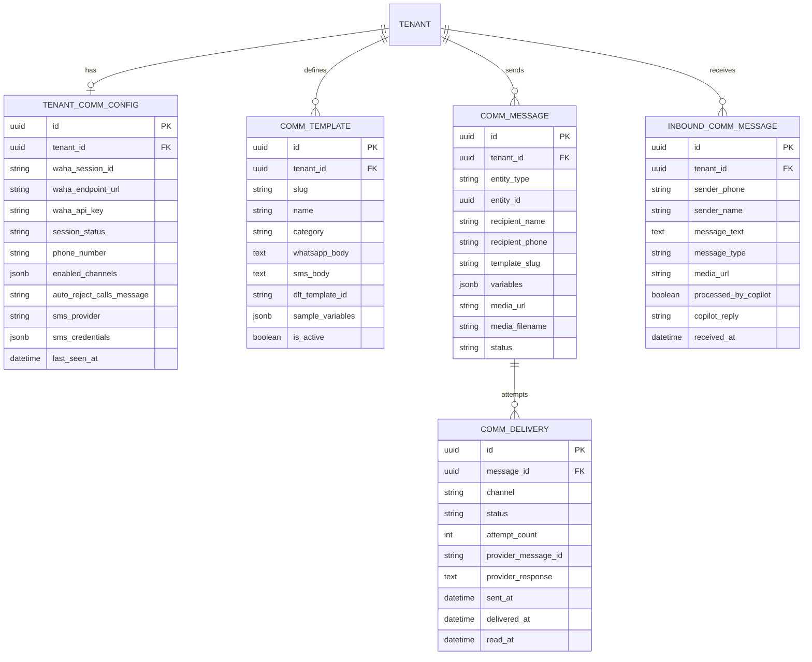
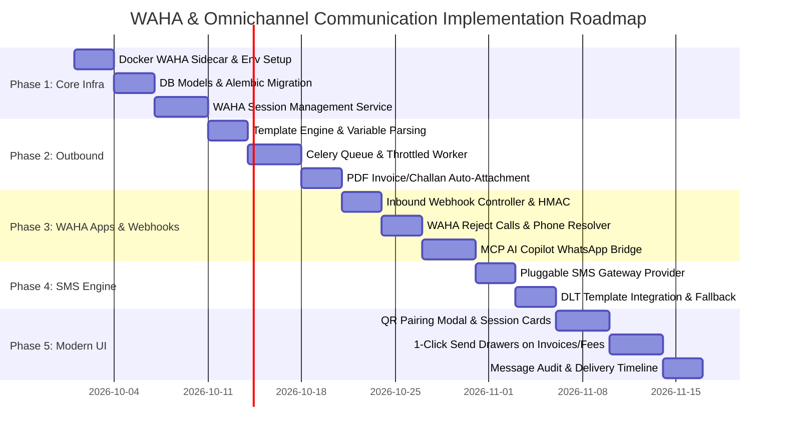

# MaterialOS Omnichannel Communication Architecture: WAHA (WhatsApp HTTP API) & SMS Integration Plan

## Executive Summary

MaterialOS is designed as a next-generation, industry-aware operating system for businesses across wholesale trade, manufacturing, civil contracting, education, healthcare, and retail. Communication is the lifeblood of these operations:
- **Building Materials Dealers** run their business on WhatsApp: sending quotations, dispatch updates, and ledger balance statements.
- **Civil & Building Contractors** need instant site notifications, delivery sign-offs, and subcontractor RA bill approvals.
- **Schools** require automated fee payment reminders with UPI links, daily attendance absence alerts, and exam report cards.

Currently, WhatsApp and SMS in MaterialOS are documented as deferred due to the high barrier of entry and strict pricing of Meta's enterprise WhatsApp Business API.

By integrating **WAHA (WhatsApp HTTP API)** by `devlike.pro` alongside a unified, pluggable **SMS & Omnichannel Engine**, MaterialOS will enable every tenant to pair their own WhatsApp number in 1-click via QR code, dispatch rich documents (invoices, receipts, BOQs, fee challans), receive customer replies, tap into modern **WAHA Apps (MCP for AI Copilot, Chatwoot CRM, Call Rejection, Phone Normalization)**, and seamlessly fall back to **SMS** when needed.

---

## 1. System Architecture Overview



---

## 2. Multi-Tenancy & WAHA Session Management

### 2.1 The Multi-Tenant Challenge in WhatsApp
In WhatsApp Web automation, each WhatsApp account corresponds to an active browser session. Tenants cannot share a single phone number; each business requires its own WhatsApp identity:
- **Tenant A (Sri Balaji Building Materials)** pairs `+91 98480 12345`
- **Tenant B (Apex Civil Contractors)** pairs `+91 94401 67890`
- **Tenant C (Greenwood International School)** pairs `+91 89123 45678`

### 2.2 Dual-Tier Deployment Topology
To cater to both shared cloud SaaS and private on-premise deployments:

1. **Managed Multi-Session Cluster (Standard SaaS)**:
   - A centralized WAHA container running with `WAHA_APPS_ENABLED=True` and multi-session capabilities.
   - Session identifiers are deterministically isolated using tenant IDs:
     $$\text{Session Name} = \text{"tenant\_" + tenant.id}$$
   - The central MaterialOS backend coordinates session startup, health monitoring, and QR code streaming.

2. **Bring-Your-Own-WAHA (BYOW / Enterprise Tier)**:
   - For enterprise tenants or high-volume distributors who run their own dedicated WAHA container or proxy.
   - The tenant enters their `WAHA_ENDPOINT_URL` and `WAHA_API_KEY` in their settings.

### 2.3 QR Code Pairing Lifecycle
1. Tenant visits **Settings &rarr; Communication &rarr; WhatsApp**.
2. Frontend requests session initialization: `POST /api/v1/communication/whatsapp/session/start`.
3. MaterialOS API calls WAHA: `POST /api/sessions` with `name="tenant_{id}"` and configured webhook URL.
4. MaterialOS polls or streams the pairing QR code via SSE: `GET /api/{session}/auth/qr`.
5. User scans the QR code from their WhatsApp Mobile App (*Linked Devices*).
6. WAHA transitions status to `WORKING` and emits a `session.status` webhook.
7. MaterialOS stores the connected phone number, battery status, and device info.

---

## 3. WAHA Apps Ecosystem Integration (Modern Adoption)

WAHA includes an extensible **Apps Framework** configured via `WAHA_APPS_ENABLED=True` and `WAHA_APPS_ON`. MaterialOS will adopt 4 flagship apps:

### 3.1 App 1: MCP (Model Context Protocol) & AI Copilot Integration
- **Concept**: WAHA's MCP App exposes a standardized interface allowing LLM agents to communicate over WhatsApp.
- **Modern Adoption in MaterialOS**:
  - Connects the tenant's WhatsApp session directly to the **MaterialOS AI Copilot**.
  - Customers or parents texting the business number can interact with an AI agent constrained to the tenant's context:
    - *Customer:* "What is my current outstanding balance?" &rarr; *Copilot (via SQL/RLS):* "Sri Balaji Constructions, your current balance is ₹4,25,000 across 2 pending invoices. Would you like a statement copy?"
    - *Parent:* "Has Greenwood School declared a holiday tomorrow?" &rarr; *Copilot (via Announcements):* "Yes, tomorrow is a public holiday as announced in the school circular."
  - **Security Gate**: The AI agent only accesses data permitted by Row-Level Security for the sender's authenticated phone number.

### 3.2 App 2: Reject Calls App (Auto-Reply & Deflection)
- **Problem**: Businesses often link a mobile number to WhatsApp, and customers/vendors attempt voice or video calls that staff cannot answer.
- **WAHA App Solution**:
  - WAHA automatically rejects incoming voice and video calls.
  - Instantly replies with a customized WhatsApp message:
    > *"Thank you for contacting Apex Civil Contractors. We do not accept voice calls on this automated WhatsApp desk. Please type your query here or log in to the portal at https://contractor.materialos.in."*
  - Message text is fully configurable per tenant.

### 3.3 App 3: Chatwoot CRM Omnichannel Inbox
- **Use Case**: For dealerships, distributors, and schools with human customer service teams.
- **Integration**:
  - WAHA connects inbound/outbound WhatsApp conversations into **Chatwoot**.
  - Multiple sales reps or customer support agents can collaborate, assign tickets, and reply to customers from a shared inbox while maintaining the official business number.

### 3.4 App 4: Phone Numbers Normalizer
- Automatically strips extraneous characters, adds country dialing codes (e.g. `+91` for India), handles mobile prefixes, and resolves WhatsApp JIDs (`9848012345` &rarr; `919848012345@c.us`), eliminating delivery failures caused by inconsistent phone entry.

---

## 4. Vertical-Specific Business Workflows

| Business Profile | Trigger Event | WhatsApp / SMS Payload | Document Attachment |
| :--- | :--- | :--- | :--- |
| **Building Materials** *(Dealer ERP)* | Quotation Created | *"Dear {customer}, Sri Balaji Building Materials has generated Quotation #{quote_no} for ₹{amount}. Valid for 7 days."* | Dynamic PDF Quote |
| | Dispatch Challan Issued | *"Truck {vehicle_no} driven by {driver_name} ({driver_phone}) has dispatched {qty} bags cement to site {site_name}. Track ETA here: {link}"* | Delivery Challan PDF |
| | Payment Recorded | *"Receipt Confirmed! We received ₹{amount} via {mode}. Current ledger balance: ₹{outstanding}."* | Official Receipt PDF |
| | Monthly Statement | *"Monthly Ledger Statement for {month}. Total Debits: ₹{debits}, Total Credits: ₹{credits}."* | Signed Ledger Statement PDF |
| **Construction / Contractors** *(Contractors ERP)* | BOQ Subcontractor Bill Approved | *"Apex Civil Contractors: RA Bill #{bill_no} for Project {project_name} approved for ₹{approved_amount}. Net payable after 5% retention: ₹{net_amount}."* | RA Bill Summary PDF |
| | Site Material Dispatch | *"Consignment #{dispatch_no} dispatched to {site_name}. Material: 20 MT Fe-550D TMT Rebar. Unloading team must verify inspection."* | Site Gate Pass PDF |
| | Joint Measurement Request | *"Joint measurement scheduled for Chainage 18+400 on {date} at 10:00 AM. Site Engineer: Er. S. R. Murthy."* | Measurement Schedule PDF |
| | DPR Site Digest | Daily 7:00 PM summary to Project Director: *"NH-16 Package-4: Earthwork completed 850 CUM, Concrete poured 120 CUM. 0 safety incidents."* | Daily Site Report PDF |
| **School Management** *(School ERP)* | Student Absentee Alert | *"Greenwood Alert: {student_name} was marked ABSENT for Grade {class}-{section} on {date}. If unexpected, contact attendance office."* | — |
| | Fee Invoice Issued | *"Term 1 Fee Invoice generated for {student_name}: ₹{fee_amount}. Due date: {due_date}. Click here to pay via UPI: {upi_pay_link}"* | Fee Challan / Receipt PDF |
| | Exam Results Published | *"Final Term Report Card published for {student_name}. Overall Grade: {grade} (Percentage: {pct}%)."* | Digital Report Card PDF |
| | Bus Transport Arrival | *"School Bus #{bus_no} is 5 minutes away from your morning pickup stop ({stop_name})."* | Live Location Pin |
| **Diagnostic Labs** | Test Results Ready | *"Your diagnostic reports for Sample ID #{sample_id} are authorized and ready for download."* | Barcoded & Signed Lab Report PDF |

---

## 5. Pluggable SMS Architecture (Future-Proofing)

To support transactional SMS alongside WhatsApp, MaterialOS will implement a clean provider abstraction:

```python
# app/services/communication/base.py
from abc import ABC, abstractmethod
from typing import Optional
from pydantic import BaseModel

class OutboundMessage(BaseModel):
    recipient_phone: str
    recipient_name: Optional[str] = None
    template_slug: str
    template_variables: dict
    fallback_text: str
    media_url: Optional[str] = None
    media_filename: Optional[str] = None
    dlt_template_id: Optional[str] = None  # India SMS Regulatory requirement

class DeliveryResult(BaseModel):
    success: bool
    channel: str  # "whatsapp" | "sms"
    external_id: Optional[str] = None
    detail: str
    retryable: bool = False

class CommunicationProvider(ABC):
    @abstractmethod
    def send_message(self, message: OutboundMessage) -> DeliveryResult:
        pass
```

### 5.1 Smart Channel Cascade & Fallback
Tenants can configure delivery policy per notification type:
1. **WhatsApp Preferred, SMS Fallback**: Attempt WhatsApp via WAHA first. If WAHA returns `404 Not a WhatsApp User` or delivery fails after 2 retries, automatically dispatch via SMS.
2. **Dual-Dispatch (High Priority)**: Fire both WhatsApp and SMS simultaneously (e.g. Critical Safety Alerts or Student Absence notices).
3. **SMS Only**: For regulatory transactional OTPs or regions where WhatsApp data is restricted.

### 5.2 Regulatory & DLT Compliance (India)
For SMS in India, telecom regulations mandate **DLT (Distributed Ledger Technology)**:
- Pre-approved Header ID (e.g. `BALAJI`, `APEXCL`, `GWISCH`).
- Pre-approved Content Template ID mapped per message type.
- The schema will store `dlt_entity_id` and `dlt_template_id` directly in `communication_templates`.

---

## 6. Database Models & Schema Design



---

## 7. Security, Anti-Ban & Operational Safeguards

WhatsApp accounts that send sudden bulk messages can risk being flagged or banned by Meta. MaterialOS will implement built-in enterprise safeguards:

1. **Jitter & Dispatch Pacing**:
   - Outbound messages from Celery workers are throttled: minimum 3–8 second randomized delay between dispatches.
   - Bulk messages (e.g. monthly school fee notifications to 500 parents) are queued and sent in staggered batches over several hours rather than a simultaneous burst.

2. **Transactional-First Philosophy**:
   - The platform strictly focuses on high-intent transactional messages (invoices, receipts, delivery tracking, attendance) where recipients have an active business relationship.
   - Promotional cold blasts are prevented.

3. **Opt-Out / Stop Protocol**:
   - Inbound webhook inspects incoming text: if a recipient replies `STOP` or `UNSUBSCRIBE`, the recipient's phone number is added to an automated opt-out suppression list for promotional messages.

4. **HMAC Webhook Verification**:
   - Inbound webhooks from WAHA require HMAC-SHA256 signature verification matching `WHATSAPP_HOOK_SECRET` to prevent spoofing.

5. **Strict Row-Level Security (RLS)**:
   - Tenant isolation is strictly enforced at database and session levels: Tenant A can never query or trigger messages through Tenant B's WAHA session.

---

## 8. Frontend Experience & UI Workflow

### 8.1 Settings Hub (`/settings/communication`)
- **Connection Card**:
  - Displays linked phone number, device info, battery level, and connection status pill (`WORKING`, `SCAN_QR`, `STOPPED`).
  - Interactive **"Connect WhatsApp"** modal with dynamic canvas QR code display and auto-refresh countdown.
  - Buttons for **"Restart Session"**, **"Sync Contacts"**, and **"Disconnect"**.
- **Call Rejection Settings**:
  - Toggle: *"Auto-decline incoming voice & video calls"*.
  - Textarea: Custom auto-reply message sent to callers on WhatsApp.
- **SMS Gateway Configuration**:
  - Provider selector (Twilio, MSG91, Fast2SMS).
  - API Key, Sender ID (Header), and DLT registration credentials.

### 8.2 In-App 1-Click Quick-Send Actions
- **Sales Invoices & Quotations**:
  - Primary button: *"Send via WhatsApp"* &rarr; opens quick drawer showing recipient phone number, rendered message preview, and attached PDF invoice badge &rarr; *Click to Dispatch*.
- **School Fees & Attendance**:
  - Roster view: *"Send Absence WhatsApp to All Unmarked"* button.
  - Student profile: *"Send Payment Receipt via WhatsApp"*.
- **Site Dispatch & Projects**:
  - Dispatch board: *"Send Challan to Driver & Site Manager"*.

### 8.3 Communication Center (`/communication`)
- Live timeline of all outbound and inbound messages.
- Real-time status indicators:
  - Single grey tick (Sent)
  - Double grey tick (Delivered to phone)
  - Double blue tick (Read by recipient)
  - Red exclamation (Failed & dead-letter with instant "Retry" action)

---

## 9. Phased Implementation Roadmap



### Next Steps for Execution:
1. **Infrastructure**: Add `devlikeapro/waha:latest` service to [`docker-compose.yml`](file:///home/dev/materialOS/docker-compose.yml) with shared Redis persistence.
2. **Backend**: Add database models in `app/models/communication.py` and register the communication router in `app/api/v1/communication.py`.
3. **Frontend**: Create the WhatsApp QR pairing modal and connection settings page in `apps/web/src/routes/settings/CommunicationSettingsPage.tsx`.
